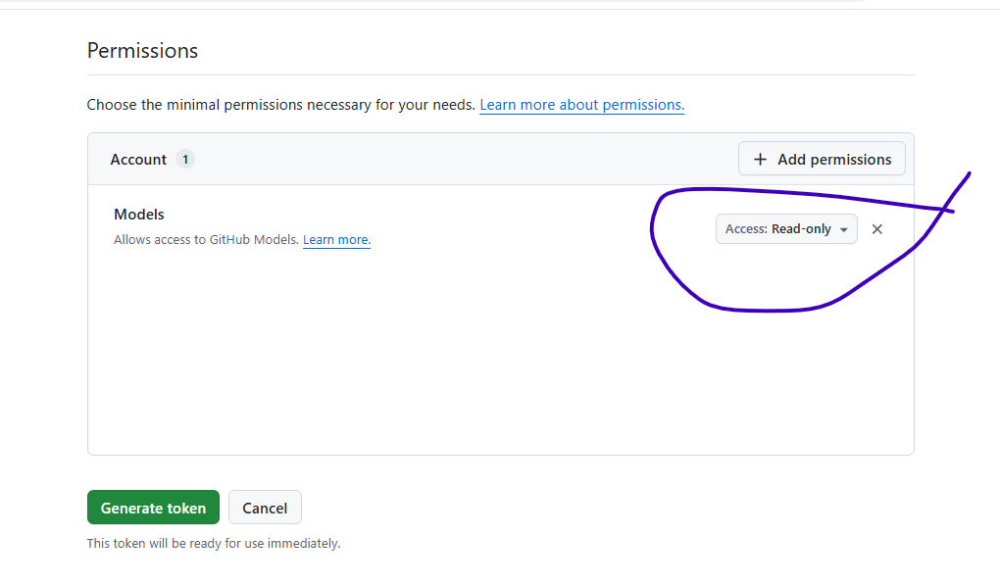

# api-keys-free
How to get keys for OpenAPI and a lot others using Github Models

## Video Explanation
Following is the video explanation of the source code. Click below to open youtube video.

## Important readonly Permission MUST be given when Creating Keys

## See the Blog Page for details

See the blog page for details
[How to get keys for OpenAPI and a lot others using Github Models, without the need of paying even a single cent to them](https://hoven.in/aspnet-core/openapi-key-for-developers.html)

